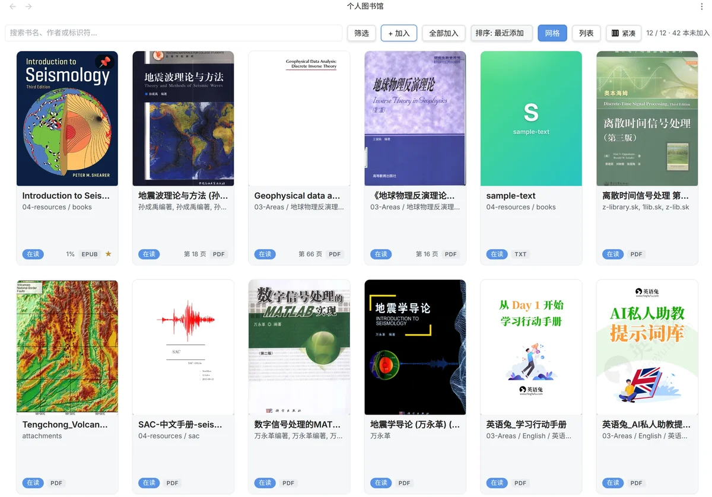

# EzReader

## Overview (English)

EzReader is an Obsidian community plugin that turns your Vault into a personal library. Books live anywhere in the Vault as ordinary files; you open them inside Obsidian to read, annotate, and track progress. All annotations are stored as plain Markdown with `[[wikilinks]]`, so they integrate seamlessly with the rest of your notes.

### Features

- **Multi-format support** — EPUB (via [foliate-js](https://github.com/johnfactotum/foliate-js) 1.0.1), PDF (via Obsidian's built-in PDF viewer with a custom overlay for highlights and selection menu), TXT (custom paged renderer with paragraph-aware pagination), MOBI / AZW3 (via [@lingo-reader/mobi-parser](https://github.com/lingo-reader/mobi-parser)).
- **Goodreads-style shelf** — sortable, filterable, pinnable; cover thumbnail + status pill (Reading / Finished / Abandoned / Not started) + path + progress + format + ★ favorite.
- **WeRead / Apple Books feel** — theme, font, and line-height controls, page-turn animation, touch swipe, keyboard navigation, floating selection menu.
- **Quick actions** — `H` to highlight + save excerpt, `B` to add a bookmark, `S` for the notes sidebar, `T` for the TOC, `← / →` for page navigation, `Esc` to close panels.
- **Markdown-native annotations** — bookmarks, excerpts, and thoughts are stored as `.md` files inside your Vault. They double-link with your other notes naturally.
- **Translation drawer** — Youdao / DeepL / Google. Long translations live in a 50vh scrollable drawer with a copy button.
- **Keyboard shortcut help** — press `?` inside the reader to see every shortcut grouped by category, including the `prev / next / sidebar / toc / translate / highlight` bindings you have customized.
- **Mobile-friendly** — `isDesktopOnly: false`. Tested on Android via Syncthing; works on iOS via Obsidian Sync.

### Quick Start (English)

1. **Install** — Download `main.js`, `manifest.json`, and `styles.css` from the [latest release](https://github.com/alei37/ez-reader/releases/latest) and drop them into `<Vault>/.obsidian/plugins/ez-reader/`. Or build from source (`pnpm run build`).
2. **Enable the plugin** — Open Obsidian → Settings → Community plugins → enable **EzReader**. The OnboardingModal pops up the first time.
3. **Open the Shelf** — Click the 📚 ribbon icon on the left, or run "EzReader: Open Shelf" from the command palette.
4. **Add books** — Click "+ Add" in the toolbar, pick EPUB / PDF / TXT / MOBI files from your Vault, confirm. Covers are auto-extracted.
5. **Read** — Click any cover on the Shelf to open the reader. The reader remembers where you left off and jumps to your last progress. After 180ms of selection, the [Thought / Excerpt / Translate / Copy] menu pops up.

For the full key map, press `?` inside the reader. The most common shortcuts are `H` (quick highlight), `B` (quick bookmark), `S` (notes sidebar), `T` (TOC), `← / →` (page), `Esc` (close panel).

## 中文简介

EzReader 是一款 Obsidian 社区市场插件,把 Vault 本身变成个人图书馆 — EPUB / PDF / TXT / MOBI / AZW3 电子书躺在 Vault 的任意位置,你在 Obsidian 里打开阅读、做笔记、记录进度,产出仍是普通 Markdown,跟 vault 里的其它笔记无缝打通。



> 个人书架:网格视图、状态 pill (在读 / 已读完 / 暂弃 / 未开始)、封面 + 标题 + 路径 + 进度 + 格式 + ★ 收藏。

## 快速开始

5 分钟把第一本书读上。

1. **安装** — 从 [GitHub Releases](https://github.com/alei37/ez-reader/releases) 下载 `main.js` / `manifest.json` / `styles.css` 三件套到 `<Vault>/.obsidian/plugins/ez-reader/`,或自己 `pnpm run build` 源码(详见 [## 安装](#安装))。
2. **启用插件** — 启动 Obsidian → Settings → Community plugins → 已安装插件里启用 **EzReader**;首次启用会自动打开 OnboardingModal 引导。
3. **打开书架** — 点击左侧 ribbon 的 📚 图标,或命令面板搜 "EzReader: Open Shelf"。
4. **加入书籍** — 工具栏 [+ 加入] → 在弹窗勾选 vault 里识别到的 EPUB / PDF → 确认;封面会自动抽取。嫌一个个勾选麻烦可以直接点工具栏的 "全部加入"(把发现的都收进来)。
5. **开始阅读** — 书架上点封面进入阅读器。如果之前读过,会自动跳到上次进度;划词后 180ms 弹出 [想法 / 摘录 / 翻译 / 复制] 菜单。

工具栏右上角 `?` 弹完整快捷键面板;常用操作 `[H]`(快速高亮) `[B]`(快速书签) `[S]`(笔记侧栏) `[T]`(目录) `[←/→]`(翻页) `[Esc]`(关闭) 记住就够用。

## 数据流一览

```text
┌──────────────────────────────────────────────────────────────────────┐
│ Shelf  (个人书架)                                                     │
│  ┌────┐ ┌────┐ ┌────┐ ┌────┐  ┌─ 状态 ─┐  ┌─ 排序 ─┐  [+ 全部加入]     │
│  │封面│ │封面│ │封面│ │封面│  │ □ 在读  │  │ 标题升序 │                 │
│  └────┘ └────┘ └────┘ └────┘  │ □ 已读完│  │ 加入降序 │                 │
│  Alice  《小王子》  ……           └────────┘  └────────┘                 │
└──────────────────────────────────────────────────────────────────────┘
                          │  点击封面
                          ▼
┌──────────────────────────────────────────────────────────────────────┐
│ Reader                                                              │
│  [📑]  [在读]  [★]  [◀] ▬▬▬▬▬ 42% [▶]  [Aa]  [📝]  [⛶]      [×]   │
│                                                                       │
│   "所有的大人都曾经是小孩——只是很少有人记得了。"                     │
│   ──────────────────────────────                                     │
│   第 1 章 · 27%                                                      │
│                                                                       │
│  [选中这段文字]                                                       │
│   ┌─────────────────────┐                                            │
│   │ 想法 │ 摘录 │ 翻译 │ 复制 │                                       │
│   └─────────────────────┘                                            │
└──────────────────────────────────────────────────────────────────────┘
                          │  选 想法 / 摘录
                          ▼
┌──────────────────────────────────────────────────────────────────────┐
│ zz_阅读与研究/阅读笔记/小王子-abcd1234.md                            │
│ ---                                                                  │
│ title: "小王子"                                                       │
│ ez-reader: /books/le-petit-prince.epub                                │
│ ---                                                                  │
│                                                                      │
│ > [!quote] 摘录                                                       │
│ > **小王子** · 第 1 章 · 进度 27% · EPUB                              │
│ > Created: 2026-01-15 21:34                                          │
│ > 返回原文: [打开阅读器](obsidian://ez-reader?book=…&annotation=…)     │
│ >                                                                    │
│ > 所有的大人都曾经是小孩——只是很少有人记得了。                       │
│                                                                    ^
│ ex-…                                                                 │
```

> 阅读器工具栏最左是目录 icon (`📑`),最右是 close icon (`×`),中间从左到右是状态 pill / ★ 收藏 / `◀▶` 导航 + 进度条 / `Aa` 字号 / 笔记 / 沉浸。所有按钮都是 lucide 图标 + 中文 aria-label,移动端 + 桌面共用。

## 核心功能

### 个人书架 (Shelf)

- **手动加入** — 选书 → 一键加入,不自动扫描 (避免 vault 满时意外全扫)。从 EPUB / PDF 元数据读标题 / 作者 / 语言。
- **多视图** — 网格 (封面卡片) / 列表 (详细信息),`G` 快捷键在工具栏切换;键盘序列 `g g` 也行(Gmail 风格)。
- **状态跟踪** — 每本书标记 `未开始 / 在读 / 已读完 / 暂弃`,状态 pill 直接点循环切换;`★` 是收藏(独立标记,跟状态分开)。
- **📌 置顶** — 网格封面右上角的图钉,点击直接 toggle;再次加入的常读书永远浮在最前。再点取消。
- **筛选 + 排序**:
  - 状态、语言、格式、进度段 (未读 / 早期 / 中期 / 后期 / 已读完)、最近打开 (今天 / 本周 / 本月 / 更早 / 从未)
  - 标题升降、作者首字母、加入时间、最近打开、阅读进度
  - 顶部搜索框,匹配标题 / 作者 / 标识符 / 路径
- **封面缓存** — 加入时异步抽取 (EPUB 用 foliate-js,PDF 沿用 Obsidian 自带),在插件目录下持久化。再次启动 vault 时不重新抽取。

### 阅读器

#### EPUB (ReaderView)

- **渲染**: foliate-js 1.0.1,带双页 / 滚动切换、跨章自动进度。
- **外观** (工具栏 `Aa` 按钮或 `Shift+H`):
  - 字号 60%–200%
  - 行距 1.0–2.4
  - 页边距 0–80 px
  - 主题:系统 / 浅色 / 暗色 / 米黄 (sepia)
  - 流动:翻页 / 滚动
- **沉浸模式** (`Shift+F`):pad / 桌面隐藏工具栏,顶部 80 px 滑动 / 鼠标移入 / 触摸调出。pad 启动时按设置自动进入。
- **进度记忆**:默认开,可关。打开书自动跳到上次位置 (cfi / page)。
- **章节标题**:nav-group 顶部永久小字显示当前章节,微信读书风格。
- **目录面板 (`T`)**:
  - 左侧 380px 边栏,树状结构 (`▾`/`▸` 折叠、缩进 + 竖线连接父/子)。
  - **键盘导航**: `↑↓` 移动焦点、`Home/End` 跳首末、`←/→` 折叠或跳父、`Enter/Space` 跳转、`Esc` 关闭。
  - **面包屑**:头部独立行显示当前章节的祖先链(`Chapter 2 › 2.1 › 2.1.2`),祖先可点击跳转。
  - **进度可视化**:每个 row 末尾 6px 圆点 — 已读绿、当前蓝、未读灰;已访问章节持久化到 `data.json`(关 viewer / 重启 Obsidian 后还在)。
  - **自动滚动**:打开面板自动滚到当前章节;搜索支持 `<mark>` 高亮。
- **多设备同步**:状态、书签、摘录、笔记都走 vault 内的 `data.json` + markdown 笔记,通过 Syncthing / git 在多设备同步 (`.obsidian/` 之外的部分)。

#### PDF

- **渲染**:PDF 文件交给 Obsidian 自带 `pdf` view 处理 (标准 Markdown 链接 `[[path.pdf]]` 走这条路);可与 [obsidian-pdf-plus](https://github.com/RyotaUshio/obsidian-pdf-plus) 等增强插件并存。
- **EzReader 浮层 (PdfOverlay)**:透明挂在 PDFView 上,提供
  - 选词菜单:翻译 / 摘录 / 复制
  - 浮动 `📝` 按钮 → 笔记侧栏 (书签 / 摘录列表,可跳转原文位置)
  - 高亮回显:重新打开 PDF 时按页 + 文本匹配自动画黄色高亮 div (text-anchor 算法,多行 / 多 word 全画)
- **跨页选区**:本版本仍按页分别保存;跨页选区按可见页分别高亮。

#### TXT / MOBI / AZW3 (PagedTextSession)

三个纯文本 / 章节文本格式共享同一个 `PagedTextSession` (跟 EPUB 的 foliate 在不同 engine,但 UX 完全一致:同一套划词 / 摘录 / 高亮 / 翻页 / 主题):

- **TXT** — UTF-8 纯文本,按段落切页 (默认 1600 字符 / 页)。切页时不让段落从中间断开,除非单段超过整页才在句子边界 (中英文标点) 硬切。HTML 特殊字符全部 escape,防注入。
- **MOBI / AZW3** — 通过 `@lingo-reader/mobi-parser` 解包 Mobipocket 章节记录,每章一页。章节内嵌的图片 / CSS 自动注入;TOC / 章节进度 / 翻页动画跟 EPUB 一致。
- **进度持久化** — 用 `position: { kind: "text", fraction, start, end }` 记录 `paged-text:<pageIdx>` 定位器,关闭重开可恢复到原页。
- **不做什么**:
  - TXT 没封面 (返回 null,书架用占位封面)。
  - 不识别 GBK / GB18030 编码 — 用户需要把 GBK 文件重新存为 UTF-8 才能正常打开。

### 选词交互 (Selection Menu)

划词后 180ms 自动弹 4 按钮菜单,布局:`想法 | 摘录 | 翻译 | 复制`。每个按钮在 label 下方显示一行小字快捷键提示(选词 menu 上直接看到,不用按 `?`):

- **想法** — 写一段不依赖选词的感想。绑定到当前章节 / 进度,落到笔记的 callout。快捷键 `Shift+T`。
- **摘录** — 高亮 + 笔记。可附加标签 (`#AI` `#方法论`) + 自己的评论。快捷键 `Shift+H`(弹 modal);不想弹 modal 就按裸 `H`,直接保存并高亮(无 tags / note 输入)。
- **翻译** — 走配置的翻译 provider (见下方),只把选中的片段发出去,不带上下文。快捷键 `Shift+T`(跟想法重叠,实际由 selection menu 决定哪一项)。
- **复制** — 写系统剪贴板,带字符数 Notice。快捷键 `C`。

中文段落里浏览器按字符分词太碎,菜单触发时会自动把选区扩到最近的句号 / 逗号 / 换行 (cap 100 字符),让想法 / 摘录更有意义。

## 常见任务

一步一步跟着做。每条都说"做 → 步骤 → 结果"。

### 1. 高亮一句话并保存摘录(带 note)

**做**: 划词 → 等菜单 → 选 [摘录] → 弹 modal 输 note + tags → 笔记侧栏自动出现。

1. 阅读时用鼠标 / 手指选中一段文字。
2. 等 180ms,选词菜单从选区下方弹出。
3. 点击 `摘录 (Shift+H)` — 也可在选完后立即按 `Shift+H` 跳过菜单。
4. modal 弹出来,在 note 输入框写你的想法;可选填 tags(空格分隔,如 `#方法论 #AI`)。
5. 点 [保存]。modal 关闭,文字变黄高亮,笔记侧栏(按 `S` 打开)立刻多一条。

**结果**: 高亮 + 摘录 + 你的 note 全部落到 `<notesDirectory>/<书名>-<id>.md`,带 Obsidian 块 ID 可反链。

### 2. 快速加书签(不弹 modal)

**做**: 阅读时按裸 `B`。

1. 在阅读器任意时刻按 `B`。
2. 书签立刻落到当前章节 + 当前进度(`第 3 章 · 42%` 格式自动 label)。

**结果**: 笔记侧栏(按 `S` → 切到 "书签" tab)多一条;以后回看能一键跳回。

### 3. 用目录快速跳章节

**做**: `T` 打开目录 → 键盘导航 → 跳转。

1. 按 `T`(或点工具栏最左的 📑)打开目录面板(380px 边栏)。
2. 用 `↑↓` 移动焦点,`Home` / `End` 跳首末,`Enter` / `Space` 跳到当前焦点。
3. 父项按 `→` 展开 / `←` 折叠;叶子上的 `←` 会跳到父项。
4. 头部独立行显示面包屑(`Chapter 2 › 2.1 › 2.1.2`),任一祖先可点击跳转。
5. 顶部搜索框输 query,label 自动 wrap `<mark>` 高亮命中片段。
6. 每个章节末尾的圆点:绿 = 已读 / 蓝 = 当前 / 灰 = 未读;已访问章节持久化,重启 Obsidian 也在。
7. `Esc` 关闭面板。

### 4. 翻译一个生词

**做**: 划词 → 选 [翻译] → 抽屉滑出译文。

1. 先在 Settings → EzReader → 翻译 选 provider 并填 API key(详见 [## 翻译](#翻译))。没填时按钮直接抛错,这是设计。
2. 选中一个词或短语 → 180ms 后选 [翻译]。
3. 屏幕右侧(或下方,看 viewport)滑出一个抽屉,里面是译文。`max-height: 50vh`,长译文不会撑出屏幕。
4. 点抽屉里的 [复制] 把译文拷到剪贴板(按钮短暂变 ✓ 已复制,1.5s 后还原)。

**注意**: 翻译是**唯一**会出 vault 的网络功能,只在用户主动按按钮时发生;只发选中的片段,不发文件 / 上下文 / user id。详见 [PRIVACY.md](PRIVACY.md)。

### 5. 修改已保存的摘录 note

**做**: 笔记侧栏 → 点 note 文字 → 虚线边框可编辑 → blur 保存。

1. 按 `S` 打开笔记侧栏,找到要改的那一条。
2. 默认 note 收起,显示 previewText + `▸`;点 `▸` 或直接点 note 文字。
3. 自动进入 contenteditable 状态,文字有虚线边框;全选文字可直接覆盖。
4. 改完点别处(blur)→ 自动保存;或 `Cmd/Ctrl + Enter` 强制保存;`Esc` 取消还原。

**结果**: 摘录的 note 字段被 patch,不会重写 highlight / createdAt / 原文;vault 里的 markdown 笔记同步更新。

### 6. 切换书的状态

**做**: 书架 → 点书的 status pill(在读)→ 循环。

1. 在书架上找到那本书(grid / list 都行),底部的状态 pill `在读`。
2. 直接点 pill — 按 `在读 → 已读完 → 暂弃 → 未开始 → 在读` 循环。
3. 想要特定状态?右键 → 上下文菜单有 "标记为已读完 / 在读 / 暂弃" 直接跳。

**结果**: 状态立即落盘,下次工具栏(在 reader 里)或书架 pill 同步显示。读到的进度也会自动 infer(`updatePosition` 把 fraction ≥ 95% 标为已读完,< 0 标回未读)。

### 7. 置顶一本书到最前

**做**: 网格封面右上角点图钉 → 直接置顶。

1. 在网格视图里找到想置顶的书,封面右上角默认没图钉。
2. **置顶**: 直接点封面右上角的 `📌` 图标 → 立即置顶到最前(`onTogglePin` handler 直接 toggle,不弹菜单)。
3. **取消**: 再点同一个 `📌` → 取消置顶,排序恢复按当前 sort 规则。

**结果**: 书架排序按"置顶优先 + 当前 sort"重排,常读书永远在最上面。`📌` 也支持右键菜单里的 "✓ 已置顶" / "置顶到最前" 项。

### 8. 配置翻译功能

**做**: Settings → EzReader → 翻译 → 选 provider → 填 API key。

1. Settings → Community plugins → EzReader 右侧齿轮 → 翻译 section。
2. 翻译服务下拉选 `有道智云` / `DeepL` / `Google Translate (Cloud v3)` 之一;选 `关闭` 表示不启用翻译。
3. 填 API key(各 provider 自己的申请流程,链接在 settings 页内);key 存在本地 `data.json`,只发给对应 provider 的鉴权端点。
4. 目标语言默认 `zh-CN`,可改。

**结果**: 选词菜单的 [翻译] 按钮立即可用。改 provider / key 会在 30s 内生效(translate 有 cache,settings 改动立即 bust)。

## 键盘快捷键

| 操作 | 默认键 | 备注 |
|------|--------|------|
| 上一页 | `←` / `PageUp` / `Shift+Space` | |
| 下一页 | `→` / `PageDown` / `Space` | |
| 跳到首 / 末 | `Home` / `End` | |
| **快速高亮** (无 modal) | `H` (裸) | 选词后直接保存摘录 + 黄色高亮,不弹输入框 |
| **快速加书签** (无 modal) | `B` (裸) | 一键加书签,label = `Chapter · %` |
| 保存摘录 (modal) | `Shift+H` | 弹 note + tags 输入框,可加评论 |
| 翻译选词 | `Shift+T` | 抽屉滑出译文 |
| 想法(不依赖选词) | `Shift+T` | 跟翻译同键,由上下文决定 |
| 复制选区 | `C` | |
| 切换笔记侧栏 | `S` | |
| 切换目录 | `T` | |
| 切换沉浸模式 | `Shift+F` | (小写 `f` 不再响应,避免与 foliate 内部查找冲突) |
| 显示快捷键帮助 | `?` | 分组表格 modal,footer 显示当前 key 绑定 |
| 退出 / 关闭面板 | `Esc` | 不截获 — 让 Obsidian 默认行为也能跑 |

`prev` / `next` / `translate` / `highlight` / `toggleSidebar` / `toggleToc` 可在 Settings 里重映射。

**目录面板内**: `↑↓` 移动焦点 / `Home` `End` 跳首末 / `←→` 折叠或跳父 / `Enter` `Space` 跳转 / `Esc` 关闭 (按 `?` 看完整表)。

## 翻译 (可选,需要网络)

唯一会发网络请求的功能,且只在用户明确点击 "翻译" 时触发。详细边界见 [PRIVACY.md](PRIVACY.md)。

- **默认关闭** — 没填 API key 时 `translate` 直接抛错。
- **只发选中的片段** — 不发文件、不发上下文、不发 user identifier。
- **Key 存在本地** `<Vault>/.obsidian/plugins/ez-reader/data.json`,只发给对应 provider 的鉴权端点。
- **多个 provider 可配置**:
  - **有道翻译** (有道智云)
  - **DeepL**
  - **Google Cloud Translation v3**
- **目标语言** 从 settings 读取,默认 `zh-CN`。

填 key 切换 provider / 改目标语言 → 下一次翻译立即生效 (settings 改动会立刻 bust translation cache)。

## 平台支持

- **桌面** (Windows / macOS / Linux):Obsidian 自带 Chromium,功能全开。
- **移动** (Android / iOS):Obsidian 自带 WebView。Android 上老 WebView 缺 `Object.groupBy` / `Promise.withResolvers`,Plugin 自带 polyfill bundle 兜底。
- **最低 Obsidian 版本**:1.12.7。

## 支持的文件格式

- **EPUB** (`.epub`) — 完整支持,自带 foliate-js (带 customElements patch)。
- **PDF** (`.pdf`) — 走 Obsidian 自带 viewer + EzReader `PdfOverlay` 浮层 (选词 / 笔记 / 高亮回显)。
- **TXT** (`.txt`) — 纯 UTF-8 文本。`TxtBookReader` 按段落切页 (默认 1600 字符/页,段落不打断),渲染到 `PagedTextSession`。
- **MOBI / AZW3** (`.mobi` / `.azw3`) — Mobipocket 与 Kindle Format 8。`MobiBookReader` 包了 `@lingo-reader/mobi-parser`,章节当页、原生支持 MOBI 章节内嵌的图片 / CSS。
- **AZW** (`.azw`) — 类型已声明,但还没有 reader。书架扫描会过滤,文件不显示。等以后有人补 azw reader,只改一行 `READER_CAPABLE_FORMATS` 就生效。

## 架构

分层 port / adapter,严格 core / adapters / ui 边界:

```
core/        (纯逻辑,零 Obsidian 依赖)
   ├─ entities/    Book, Bookmark, Excerpt, ReadingState
   ├─ ports/       BookSource, BookReader, AnnotationStore, TranslationProvider, NoteWriter
   ├─ services/    LibraryService, ReadingService, TranslationCoordinator
   └─ types/       ReaderSettings, ShelfFilter, Locale

adapters/     (Obsidian / foliate / mobi-parser 具体实现)
   ├─ obsidian/    ObsidianBookSource, ObsidianAnnotationStore, CoverCache, ObsidianNoteWriter
   ├─ foliate/     FoliateBookReader (EPUB)
   ├─ text/        TxtBookReader (TXT) + MobiBookReader (MOBI/AZW3) + PagedTextSession (共享 session)
   └─ translation/ YoudaoTranslationProvider, DeeplTranslationProvider, GoogleTranslationProvider, BaseTranslationProvider

ui/           (DOM 渲染,用户交互)
   ├─ shelf/       ShelfView, ShelfToolbar, ShelfFilters, AddToLibraryModal, OnboardingModal
   ├─ reader/      ReaderView, ReaderToolbar, AppearanceModal, ReaderSelectionMenu, BookmarksPanel, ExcerptsPanel, SidebarNotesPanel, TocPanel, TranslationDrawer, pdfOverlay
   └─ settings/    SettingsTab

platform/     (Obsidian runtime polyfills)
Plugin.ts     (装配所有依赖)
```

硬规则:

- `core/` 永远不 `import "obsidian"`。
- `core/ports/*` 是接口,实现必须在 `adapters/`。
- `ui/` 通过 port 跟 core 通信,不直接读文件。

测试只覆盖 `core/`(`tests/core/*.test.ts` → `tests/dist/core/*.mjs` → `node --test`),不启动 Obsidian runtime。

## 隐私 / 数据落盘

- 原书文件**只读**,从不拷贝 / 移动 / 重命名 / 删除。
- 状态、书签、摘录、收藏、置顶、进度、设置、首次加入时间、首次打开封面缓存索引,都存在 `<Vault>/.obsidian/plugins/ez-reader/data.json`。
- 封面图片缓存到 `<Vault>/.obsidian/plugins/ez-reader/data/covers/`,删除不影响阅读数据 (下次打开书时重新抽取)。
- Per-book markdown 笔记写到用户配置的 `notesDirectory`,带 Obsidian 块 ID 可双向链接。
- 翻译是唯一会出 vault 的网络动作,只在用户主动触发时发生。

## 已知边界

- 扫描版 PDF 没有 OCR (EzReader 不解析扫描图)。
- 不做自动分类 / 重命名 / 移动 / 合并 / 删除书文件。
- PDF 跨页选区不支持 — 每页独立保存,跨页选区按可见页分别高亮。
- **PDF "回到原文" 链接** 只跳到页 (`#page=N`),不支持跳到页内精确 subpath
  (4-tuple begin/end offset)。需要等 Obsidian PDFView 暴露内部 API 才能精确。
  当前行为:跳到页 + highlight 画在正确位置,可能要手动 scroll 一下看到。
- **PDF++ / 接管 PDF 的第三方插件** 可能改 Obsidian PDFView 的 DOM 结构,
  EzReader 的 PdfOverlay 挂不上 → 跳页走 fallback `setEphemeralState`
  (会有 `handleProtocol: PdfOverlay not found` console 警告)。不影响阅读。
- **MOBI 大文件 (>5 MB)** `createParser` 同步解压 2-5 秒,UI 短暂假死。
  已知问题,下次重写用 Web Worker 异步解压。
- **TXT 跨页摘录** 不支持 — 单页渲染架构下浏览器 selection 只在可见 DOM。
- **Android 端未测**。foliate iframe 在 Android WebView 行为可能有差异。
- AZW 暂未实现 reader — 类型已声明,书架扫描过滤,等以后补 reader 时只改一行 `READER_CAPABLE_FORMATS`。
- TXT 默认假设 UTF-8 编码;GBK / GB18030 文件需要用户先重新存为 UTF-8 才能正常打开。
- 翻译 provider 看到用户选中的内容,敏感文本请勿选中翻译。

## 常见问题 (FAQ)

**Q: PDF 加载后没看到笔记侧栏 / 选词菜单?**

A: 大概率 PDF++ 等第三方插件接管了 Obsidian PDFView,改了 DOM 结构。EzReader 的 `PdfOverlay` 挂不上。看 console 有 `[ez-reader] handleProtocol: PdfOverlay not found` 警告。**不影响阅读**,跳页走 fallback `setEphemeralState` / `openLinkText("#page=N")`。临时禁用 PDF++ 测试;或等我们加 PDF++ 兼容。

**Q: MOBI 大文件打开时 UI 卡 2-5 秒?**

A: 已知问题。`@lingo-reader/mobi-parser` 的 `createParser` 同步解压大文件阻塞主线程。已知 P1 polish,下一版用 Web Worker 异步解压。小文件(< 5 MB)无此问题。

**Q: TXT 显示乱码?**

A: 插件只认 UTF-8。GBK / GB18030 文件需要先用编辑器(VSCode / Notepad++)重新存为 UTF-8 再加入。decodeText 内部会先 strict UTF-8 → GB18030 → permissive UTF-8 fallback,部分 GBK 文件能自动识别,但不能保证。

**Q: 翻译没反应 / 报 "未配置 API key"?**

A: Settings → EzReader → 翻译 section → 选 provider → 填 API key。**没填 key 时翻译功能直接抛错,是设计**(避免把文本默默发到默认 endpoint)。隐私边界见 [PRIVACY.md](PRIVACY.md)。

**Q: 进度在 Android 平板上不同步?**

A: Syncthing 默认排除 `.obsidian/` — **包括** `data.json`。需要手动配置 Syncthing 把 `<Vault>/.obsidian/plugins/ez-reader/data.json` 加入同步。或者把书架 + 笔记放到 vault 其他位置(笔记本来就在 `notesDirectory` 里,跟 `.obsidian/` 平级,默认会被 Syncthing 同步)。

**Q: 怎么在笔记里反链到一条摘录?**

A: 摘录有 Obsidian 块 ID (`^ex-uuid`)。在其它笔记写 `[[book-note#^<excerptId>]]` 即可反链,Obsidian 会自动 preview 这条摘录。也可点摘录的 "回到此摘录" 复制块 ID 链接,粘贴到目标笔记。

**Q: 升级插件会丢数据吗?**

A: 不会。所有状态在 `<Vault>/.obsidian/plugins/ez-reader/data.json`,升级只换 `main.js` + `manifest.json` + `styles.css`,data.json 不动。Schema 加新字段时都用 optional + fallback,旧 data.json 兼容(新字段读不到时用默认值)。

**Q: 怎么彻底卸载?**

A: 删 `<Vault>/.obsidian/plugins/ez-reader/` 整个目录即可。**注意**: `data.json` 和 `data/covers/` 也在这个目录下,删了等于清空所有书签 / 摘录 / 进度 / 收藏 / 封面缓存。如果想保留,先备份 `data.json` + `data/covers/` 再删。重新安装插件 + 把备份拷回,数据立刻恢复。

## 安装

### 推荐:从 GitHub Release

到 [Releases](https://github.com/alei37/ez-reader/releases) 下载 zip,解压到:

```
<Vault>/.obsidian/plugins/ez-reader/
├── main.js
├── manifest.json
└── styles.css
```

启动 Obsidian → Settings → Community plugins → 启用 **EzReader**。

### 源码编译

需要 Node.js ≥ 22.13.0 + pnpm ≥ 11.9.0。

```bash
pnpm install --frozen-lockfile
pnpm run build     # 产出 main.js / styles.css / manifest.json
```

部署到本地 vault:

```bash
cp main.js styles.css manifest.json /path/to/<Vault>/.obsidian/plugins/ez-reader/
```

## 开发工作流

```bash
pnpm test            # 单元测试 (307/307 通过, 29 个 .test.ts)
pnpm run build       # 类型检查 + esbuild 打包
pnpm run dev         # watch 模式 (主进程变化,需 Obsidian 端 reload)
pnpm run dev:web     # watch 模式 (client-plugin)
```

改完代码 → `pnpm run build` → `cp` 三个文件到 vault 目录 → Obsidian 里 `Ctrl/Cmd+P` → "Reload app without saving"。

不直接 commit / push — 本地改完 + 用户验证后再 `git add . && git commit && git push`。

## 作者与许可

- 作者:[alei37](https://github.com/alei37)
- License:[MIT](LICENSE)
- 第三方组件保留各自许可,见 [LICENSES/](LICENSES)