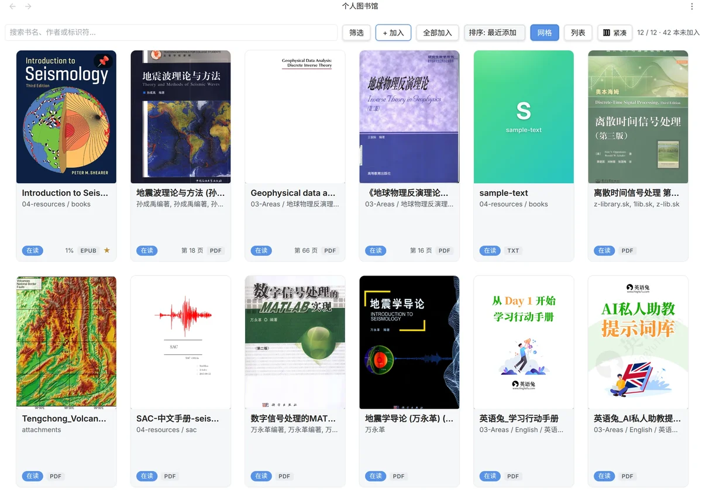

# EzReader

**English** → [README.md](README.md) · **中文**(本文件)

在 Obsidian 里读本地电子书 — 进度跟踪、高亮、研究笔记、可选在线翻译。



## 快速开始

1. 从 [GitHub Releases](https://github.com/alei37/ez-reader/releases/latest) 下载 `main.js`、`manifest.json`、`styles.css` 三个文件,放进 `<Vault>/.obsidian/plugins/ez-reader/`。
2. Obsidian → 设置 → 第三方插件 → 启用 **EzReader**。
3. 点击左侧 ribbon 的 📚 图标(或命令面板搜 "EzReader: Open Shelf"),挑几本 EPUB / PDF / TXT / MOBI 加进来。
4. 点封面进入阅读。划词 180ms 后弹出 [想法 / 摘录 / 翻译 / 复制] 菜单。在阅读器里按 `?` 看完整快捷键。

## 功能

**多格式阅读** — EPUB(基于 [foliate-js](https://github.com/johnfactotum/foliate-js))、PDF(用 Obsidian 内置 viewer + 自建 overlay 做高亮和选词菜单)、TXT(段落感知分页)、MOBI / AZW3(基于 `@lingo-reader/mobi-parser` 按章节翻页)。

**Goodreads 风格书架** — 网格 / 列表双视图,可排序、可筛选(状态 / 语言 / 进度 / 最近打开)、可置顶、封面缓存。点状态 pill 循环切换 `未开始 → 在读 → 已读完 → 暂弃`。

**微信读书 / Apple Books 体验** — 外观设置弹窗(字号 60-200% / 行距 / 边距 / 主题 系统-浅-暗-米黄 / 翻页或滚动)、沉浸模式、翻页动画、触屏滑动、选词菜单每个按钮下方带小字快捷键提示。

**笔记原生 Markdown** — 书签、摘录、想法都存成 `.md` 文件。摘录带 Obsidian 块 ID (`^ex-uuid`),任何笔记里写 `[[book-note#^<excerptId>]]` 即可反链。

**快捷操作** — `H` 一键保存摘录(无 modal)、`B` 一键加书签(label 自动 `Chapter · %`)、`Shift+H` 弹 modal 输 note + tags、`Shift+T` 写想法或翻译(上下文决定)。

**6 家翻译 provider** — 有道 / DeepL / Google Cloud / MyMemory (免费, 无需 key) / OpenAI 兼容 (DeepSeek / 智谱 / 通义 / OpenAI) / Anthropic 兼容 (e.g. MiniMax)。EPUB/TXT/MOBI 翻译结果走右侧抽屉,PDF 翻译结果走可拖拽浮动小弹窗。

**全键盘操作** — 目录面板 `↑↓` 移动、`←/→` 折叠或跳父、`Enter` 跳转;已访问 / 当前 / 未访问章节进度点持久化跨 session。

## 各格式说明

### EPUB

基于 [foliate-js](https://github.com/johnfactotum/foliate-js) 1.0.1(带 customElements patch)。双页 / 滚动模式可切,自动恢复上次位置。

### PDF

> **想要最好的 PDF 阅读体验,推荐装 [obsidian-pdf-plus](https://github.com/RyotaUshio/obsidian-pdf-plus)**。它比 EzReader 这层薄 overlay 强得多(注释、搜索、目录、跳页等)。**注意:** PDF++ 会替换 Obsidian 内置 PDFView 的 DOM,所以 EzReader 下面列的 PDF overlay 功能跟它 **不能共存** — 二选一。

EzReader 走 Obsidian 自带的 `pdf` view — 标准 `[[path.pdf]]` 链接直接可用。透明 overlay 加 (前提:没装第三方 PDF 接管插件):

- **选词菜单** — 跟 EPUB 一样的 想法 / 摘录 / 翻译 / 复制
- **翻译浮动小弹窗** 锚到选词处,**header 可拖拽**(边界 clamp 到视口)。有 复制 / 换语言重译 / × 按钮
- **浮动 📝 按钮** → 书签 / 摘录列表,一键跳回原文。**按钮本身也可拖** — 位置按书 localStorage 持久化,重启 Obsidian 后还在原位
- **高亮回显** — 重开 PDF 时按页 + 文本匹配自动画黄色高亮
- **重启后自动接管** — Obsidian 重启时 `PdfOverlay` 自动 attach(不再"翻译失效")
- **点黄线查看/编辑想法** — 点已有黄色高亮 → 自动打开笔记侧栏 + 跳到对应摘录 + 进 inline 编辑

### TXT / MOBI / AZW3

三种纯文本 / 章节文本格式共享 `PagedTextSession` — 划词 / 高亮 / 翻页 / 主题跟 EPUB 一致。TXT 只认 UTF-8(不自动识别 GBK)。

## 键盘快捷键

| 操作 | 键 | 操作 | 键 |
|---|---|---|---|
| 上一页 | `←` / `PageUp` | 笔记侧栏 | `S` |
| 下一页 | `→` / `PageDown` | 目录 | `T` |
| 快速高亮 | `H` (裸) | 沉浸模式 | `Shift+F` |
| 快速书签 | `B` (裸) | 快捷键帮助 | `?` |
| 摘录 (modal) | `Shift+H` | 关闭面板 | `Esc` |
| 翻译 / 想法 | `Shift+T` | 复制选区 | `C` |

`prev / next / translate / highlight / toggleSidebar / toggleToc` 在设置里可重映射。目录面板内:`↑↓ Home End ←→ Enter Space Esc`。

## 翻译

唯一会出 vault 的网络功能,且只在用户主动按按钮时触发。只发选中的片段,不发文件或上下文。配置存本地 `data.json`,走 Obsidian `requestUrl` 绕过渲染端 CSP。

| Provider | 免费额度 | 需要 | 备注 |
|---|---|---|---|
| **有道** | 100 字符/月 | appKey + appSecret | 国内访问稳 |
| **DeepL** | 50 万字符/月 (`:fx` 结尾) | API key | 质量高 |
| **Google Cloud Translation v3** | 50 万字符/月 | service-account JSON | 需绑卡 |
| **MyMemory** | 1 万字符/IP/日 | **无** | 真零注册 |
| **OpenAI 兼容** | 看账户余额 | baseUrl + key + model | DeepSeek / 智谱 / 通义 / OpenAI |
| **Anthropic 兼容** | 看账户余额 | baseUrl + key + model | e.g. MiniMax (`https://api.minimax.cn/anthropic`) |

默认目标语言 `zh-CN`。切 provider 会清空旧 key(各 provider 配置格式不通用)。

## 安装

### 从 GitHub Release(推荐)

从 [Releases](https://github.com/alei37/ez-reader/releases) 下载三个文件放进 `<Vault>/.obsidian/plugins/ez-reader/`。打开 Obsidian → 第三方插件 → 启用 EzReader。

### 从源码编译

```bash
pnpm install --frozen-lockfile
pnpm run build   # 产出 main.js / styles.css / manifest.json
cp main.js styles.css manifest.json /path/to/<Vault>/.obsidian/plugins/ez-reader/
```

需要 Node.js ≥ 22.13、pnpm ≥ 11.9。

## FAQ

<details>
<summary><strong>PDF 打开了但没笔记侧栏 / 没选词菜单?</strong></summary>

有第三方插件(PDF++ 等)接管了 Obsidian PDFView 改了 DOM,EzReader 的 overlay 挂不上。看 console 有没有 `[ez-reader] handleProtocol: PdfOverlay not found`。阅读不受影响 — 跳页 fallback 走 `setEphemeralState` / `openLinkText("#page=N")`。我们建议保留 PDF++(PDF 阅读体验更好)同时接受 EzReader 的 PDF overlay 在那里不工作;临时禁用 PDF++ 可试 EzReader overlay。
</details>

<details>
<summary><strong>打开大 MOBI 卡 2-5 秒?</strong></summary>

`@lingo-reader/mobi-parser` 的 `createParser` 同步解压阻塞主线程。下一版会搬到 Web Worker。< 5 MB 文件没事。
</details>

<details>
<summary><strong>TXT 乱码?</strong></summary>

只认 UTF-8。把 GBK / GB18030 文件用 VSCode / Notepad++ 转 UTF-8 再导入。`decodeText` 内部 strict UTF-8 → GB18030 → permissive UTF-8 fallback,部分 GBK 文件能自动识别但不保证。
</details>

<details>
<summary><strong>翻译报 "API key not configured"?</strong></summary>

设计如此 — 不默默把文本发到默认端点。设置 → EzReader → 翻译 → 选 provider 填 key。详见 [PRIVACY.md](PRIVACY.md)。
</details>

<details>
<summary><strong>进度在 Android 平板不同步?</strong></summary>

Syncthing 默认排除 `.obsidian/` — 包括 `data.json`。配置 Syncthing 同步 `<Vault>/.obsidian/plugins/ez-reader/data.json`。笔记在 `notesDirectory` 里(默认 vault 根,不在 `.obsidian/` 下),自动同步。
</details>

<details>
<summary><strong>升级会丢数据吗?</strong></summary>

不会。升级只换 `main.js` + `manifest.json` + `styles.css`,所有状态在 `data.json`,新字段都是 optional + 默认值,旧 data.json 兼容。
</details>

<details>
<summary><strong>怎么完全卸载?</strong></summary>

删 `<Vault>/.obsidian/plugins/ez-reader/`。要保留数据,先备份 `data.json` + `data/covers/`。
</details>

## 已知限制

<details>
<summary>点击展开</summary>

- 扫描版 PDF 没文字层(没做 OCR)
- PDF 跨页选区分两条独立高亮保存
- PDF "回到原文" 链接跳到页但需要手动滚一点对齐(等 Obsidian PDFView 暴露 subpath offset API)
- 大 MOBI 文件 2-5 秒阻塞主线程(已知问题)
- TXT 跨页摘录不支持(单页渲染)
- Android 端未测
- AZW 类型已声明但 reader 未实现
- GBK / GB18030 TXT 需手动转 UTF-8
- 翻译 provider 看得到你选的内容 — 敏感文本别选中翻译

</details>

## 隐私

- **源文件只读** — 从不拷贝 / 移动 / 重命名 / 删除
- 所有状态(书签、摘录、想法、收藏、进度、设置、封面缓存索引)都在 `<Vault>/.obsidian/plugins/ez-reader/data.json`
- 封面图片缓存在 `<Vault>/.obsidian/plugins/ez-reader/data/covers/`
- Per-book Markdown 笔记写到配置的 `notesDirectory`(默认 `ezreader-notes/`,首次保存时自动建,无需手动 `mkdir`)
- 翻译是唯一出 vault 的网络动作,且只在用户主动触发时执行

## 架构

严格 core / adapters / ui 分层,port-and-adapter。`core/` 是纯逻辑无 Obsidian 依赖;`adapters/` 包装 Obsidian / foliate / mobi-parser / 翻译 provider;`ui/` 是 DOM 渲染。测试只覆盖 `core/`(`tests/core/*.test.ts`,307 / 307 通过)。

## 开发

```bash
pnpm test           # 307 / 307 单元测试
pnpm run build      # 类型检查 + esbuild 打包
pnpm run dev        # watch 模式(需 Obsidian 端 reload)
```

本地改完 + 在 vault 验证后 `git commit && git push`。Release workflow(`.github/workflows/release.yml`)在每次 tag 时自动 build + 上传三件套。

## 许可

[MIT](LICENSE) © [alei37](https://github.com/alei37)。第三方组件保留各自许可,见 [`LICENSES/`](LICENSES)。

**English** → [README.md](README.md) · 详细变更 [CHANGELOG.md](CHANGELOG.md)